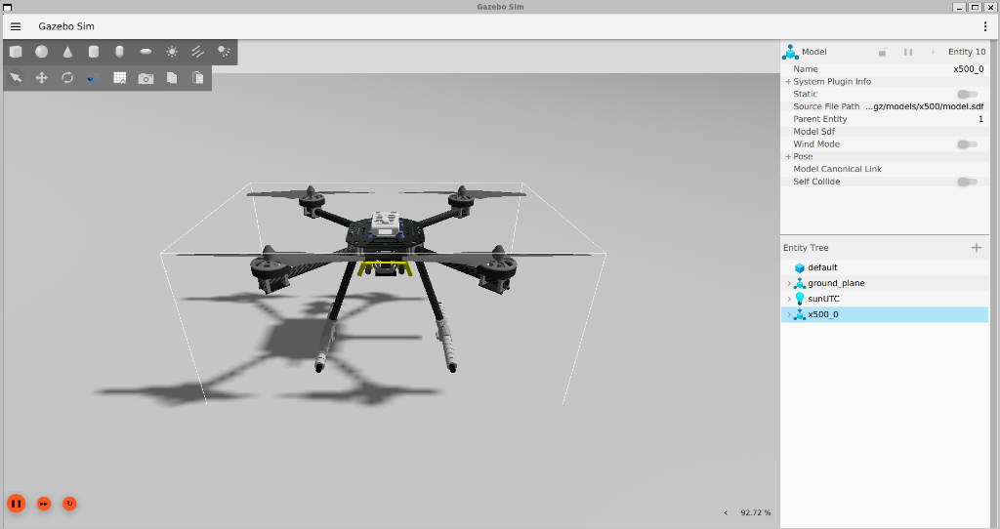
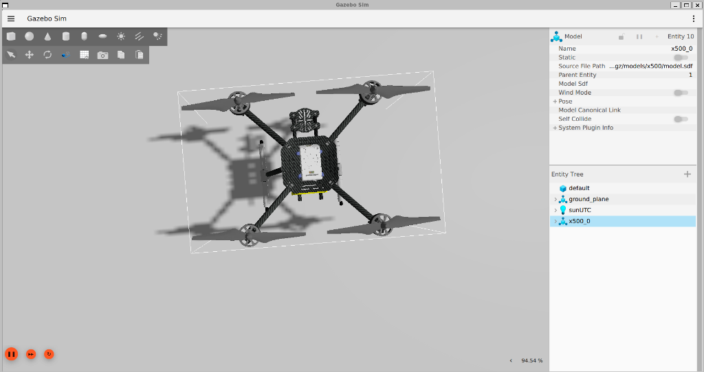

# Autonomous UAV Trinity Stack: AEGIS, Swarm & Zenith

[](https://docs.ros.org/en/jazzy/index.html)
[](https://gazebosim.org/home)
[](https://github.com/)

A comprehensive, production-grade autonomous drone ecosystem. This repository integrates three core pillars of modern robotics: **Failure Resilience**, **Multi-Agent Coordination**, and **AI-Driven Perception.**

## 🏗️ System Architecture


## 🎥 Real-Time Flight & Failsafe Simulation (Gazebo Harmonic)

To validate the VANGUARD fail-safe autonomy, we run a high-fidelity **Software-in-the-Loop (SITL)** simulation using **PX4 Autopilot** and the cutting-edge **Gazebo Harmonic (GZ Sim)**. The ROS 2 Brain controls the drone dynamically via offboard setpoints over a high-speed **Micro-XRCE-DDS** bridge.

| 🛫 Autonomous Takeoff (5m Position Target) | 🛬 Emergency RTL Landing (Triggered by Failsafe) |
|:---:|:---:|
|  |  |
| *Node switches PX4 to OFFBOARD mode, arms the motors, and commands a stable 5m hover.* | *Simulated battery failure triggers the safety state machine, commanding an immediate Return-to-Launch.* |

## 🌌 The Trinity Pillars
This repository integrates three core pillars of modern robotics: **Failure Resilience**, **Multi-Agent Coordination**, and **AI-Driven Perception.**

## 🛠️ Flagship Projects

### 🛡️ 1. Project AEGIS (Failure-Resilient Autonomy)
- **Status:** Operational ✅
- **Features:** Multi-state failsafe logic, high-frequency telemetry logging, and Chaos Engineering (Failure Injection) verification.

### 🐝 2. Project Swarm (Collaborative Intelligence)
- **Status:** Operational ✅
- **Features:** Decentralized discovery via Zenoh/DDS, multi-agent occupancy grid merging, and isolated namespace scaling.

### 🔭 3. Project Zenith (Perception & Navigation)
- **Status:** Operational ✅
- **Features:** Simulated YOLOv10 vision stream, reactive potential field obstacle avoidance, and VIO-ready navigation stack.

## 🚀 Getting Started
This entire stack is containerized using Docker for instant reproduction on any system.

```bash
# Clone and Build
cd Autonomous-UAV-Trinity-Stack
docker-compose up -d

# Launch the Full Trinity Stack
ros2 launch swarm_coordinator swarm_launch.py
```

---
*Architected and developed as a Senior Autonomous Systems Portfolio by Yogesh.*
