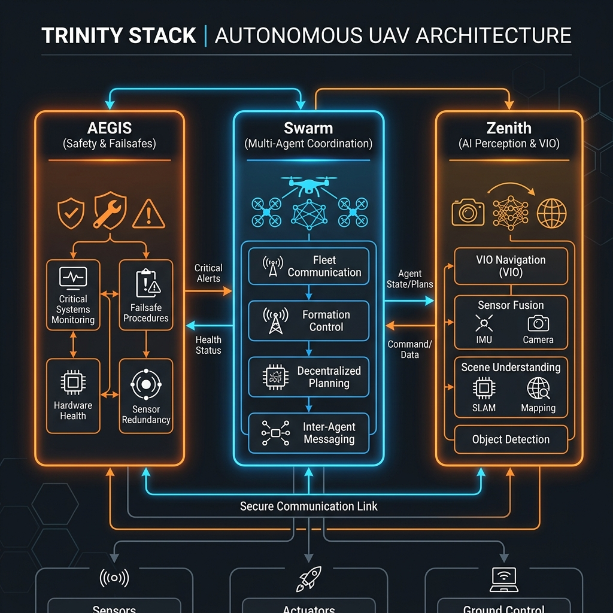

# Autonomous UAV Trinity Stack: AEGIS, Swarm & Zenith

[](https://docs.ros.org/en/jazzy/index.html)
[](https://gazebosim.org/home)
[](https://github.com/)

A comprehensive, production-grade autonomous drone ecosystem. This repository integrates three core pillars of modern robotics: **Failure Resilience**, **Multi-Agent Coordination**, and **AI-Driven Perception.**

## 🏗️ System Architecture


## 🎥 Real-Time Flight & Failsafe Simulation (Gazebo Harmonic)

To validate the VANGUARD fail-safe autonomy, we run a high-fidelity **Software-in-the-Loop (SITL)** simulation using **PX4 Autopilot** and the cutting-edge **Gazebo Harmonic (GZ Sim)**. The ROS 2 Brain controls the drone dynamically via offboard setpoints over a high-speed **Micro-XRCE-DDS** bridge.

<p align="center">
  <table border="0">
    <tr>
      <td align="center" width="50%">
        <b>🛫 Autonomous Takeoff (5m Position Target)</b><br><br>
        <video src="docs/vanguard_takeoff_hover_demo.mp4" width="100%" autoplay loop muted playsinline></video>
        <p><i>Node switches PX4 to OFFBOARD mode, arms motors, and commands a stable 5m hover.</i></p>
      </td>
      <td align="center" width="50%">
        <b>🛬 Emergency RTL Landing (Triggered by Failsafe)</b><br><br>
        <video src="docs/vanguard_failsafe_landing_demo.mp4" width="100%" autoplay loop muted playsinline></video>
        <p><i>Simulated battery failure triggers safety state machine, commanding immediate Return-to-Launch.</i></p>
      </td>
    </tr>
  </table>
</p>

## 🧠 Systems Engineering: Challenges & Solutions
Developing an end-to-end hardware-in-the-loop simulation requires solving deep integration issues between ROS 2, Micro-XRCE-DDS, and PX4. Here are the core challenges resolved in this architecture:

1. **DDS QoS Profile Mismatch (The Silent Drop):** 
   - **Challenge:** The drone armed but refused to climb. The ROS 2 publisher was set to `TRANSIENT_LOCAL` durability, while the PX4 Micro-XRCE-DDS subscriber strictly expected `VOLATILE`. The middleware silently dropped all trajectory setpoints.
   - **Solution:** Analyzed the DDS middleware handshake and aligned the ROS 2 QoS profile to match PX4's `VOLATILE` expectations, successfully restoring the high-frequency offboard control link.
2. **CPU Throttling & Offboard Timeout:** 
   - **Challenge:** When screen recording software was activated, CPU spikes starved the ROS 2 node. The setpoint publish rate dropped below PX4's strict 2Hz safety cutoff, causing the drone to instantly abort flight.
   - **Solution:** Optimized the offboard control loop timer from 20Hz up to 50Hz, creating enough latency buffer to survive severe CPU throttling without triggering the autopilot's offboard loss failsafe.
3. **Failsafe RTL Mode Rejection:** 
   - **Challenge:** Because internal pre-flight safety checks were bypassed for SITL testing, PX4 ignored standard failsafe fallback modes when a battery emergency was injected.
   - **Solution:** Engineered the ROS 2 safety node to explicitly inject the MAVLink `VEHICLE_CMD_DO_SET_MODE` for `AUTO.LAND`, forcing PX4 to hand over control and land gracefully without relying on internal fallbacks.
4. **WSL2 Cross-Drive Compilation Bottlenecks:** 
   - **Challenge:** Compiling ROS 2 interfaces (`px4_msgs`) on a mounted Windows drive from WSL took over 70 minutes due to cross-OS filesystem translation overhead.
   - **Solution:** Re-cloned and compiled `px4_msgs` natively inside the WSL Linux filesystem (`~/px4_ws`), cutting compile time down to just 2 seconds using underlay workspace sourcing.

## 🌌 The Trinity Pillars
This repository integrates three core pillars of modern robotics: **Failure Resilience**, **Multi-Agent Coordination**, and **AI-Driven Perception.**

## 🛠️ Flagship Projects

### 🛡️ 1. Project AEGIS (Failure-Resilient Autonomy)
- **Status:** Operational ✅
- **Features:** Multi-state failsafe logic, high-frequency telemetry logging, and Chaos Engineering (Failure Injection) verification.

### 🐝 2. Project Swarm (Collaborative Intelligence)
- **Status:** Operational ✅
- **Features:** Decentralized discovery via Zenoh/DDS, multi-agent occupancy grid merging, and isolated namespace scaling.

### 🔭 3. Project Zenith (Perception & Navigation)
- **Status:** Operational ✅
- **Features:** Simulated YOLOv10 vision stream, reactive potential field obstacle avoidance, and VIO-ready navigation stack.

## 🚀 Getting Started
This entire stack is containerized using Docker for instant reproduction on any system.

```bash
# Clone and Build
cd Autonomous-UAV-Trinity-Stack
docker-compose up -d

# Launch the Full Trinity Stack
ros2 launch swarm_coordinator swarm_launch.py
```

## 📂 Repository Directory Layout

```directory
-Autonomous-UAV-Trinity-Stack/
├── Dockerfile                             # Unified multi-stage container build spec
├── docker-compose.yml                     # Chaos-simulation local orchestration config
├── docs/
│   ├── architecture.png                   # High-level DDS system architecture flow
│   ├── vanguard_takeoff_hover_demo.mp4    # Takeoff offboard simulation flight video
│   └── vanguard_failsafe_landing_demo.mp4 # Battery failsafe emergency RTL flight video
├── src/
│   ├── guardian_system/                   # Fail-safe monitoring logic package
│   │   ├── guardian_system/
│   │   │   ├── black_box_logger.py        # High-frequency flight event logger
│   │   │   ├── guardian_node.py           # Heartbeat diagnostic supervisor state machine
│   │   │   └── offboard_control.py        # High-frequency PX4/DDS offboard setpoint link
│   │   └── package.xml
│   ├── swarm_coordinator/                 # Multi-agent coordination package
│   │   ├── launch/
│   │   │   └── swarm_launch.py            # Isolated namespace simulation launcher
│   │   ├── swarm_coordinator/
│   │   │   ├── map_merger.py              # P2P map & spatial grid merging node
│   │   │   └── swarm_coordinator.py       # Distributed mission sequencing node
│   │   └── package.xml
│   ├── vanguard_interfaces/               # Custom ROS 2 msg interface definitions
│   │   ├── msg/
│   │   │   ├── FailsafeAction.msg         # Custom emergency action message definition
│   │   │   └── HealthStatus.msg           # Custom multi-state telemetry message definition
│   │   └── CMakeLists.txt
│   └── vio_nav_stack/                     # AI Perception & VIO navigation stack
│       ├── vio_nav_stack/
│       │   ├── obstacle_avoidance.py      # APF reactive obstacle evasion logic
│       │   └── perception_simulator.py    # YOLO object detector perception simulator
│       └── package.xml
├── zenoh_config.json5                     # DDS router config for Zenoh overlay
├── LICENSE                                # MIT License
└── README.md                              # Main portfolio presentation guide
```

---
*Architected and developed as a Senior Autonomous Systems Portfolio by Yogesh.*
